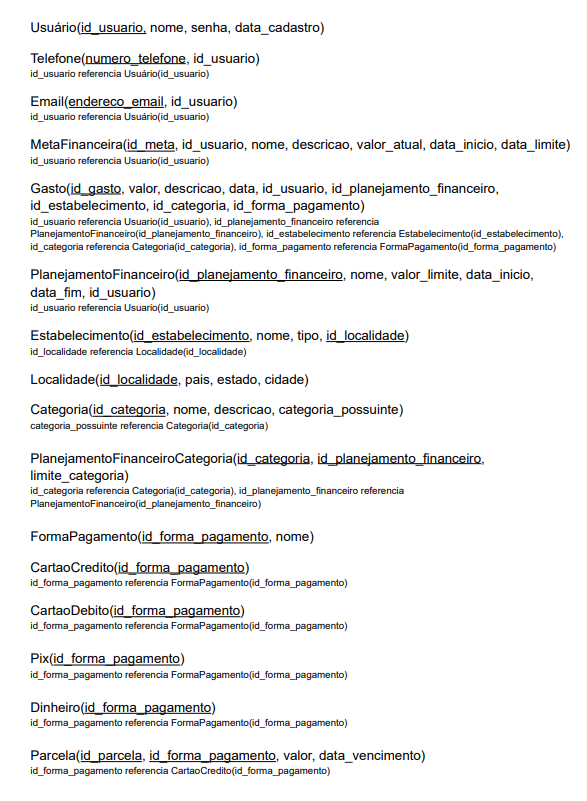
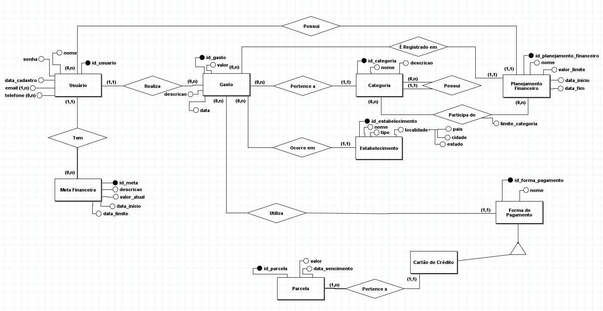
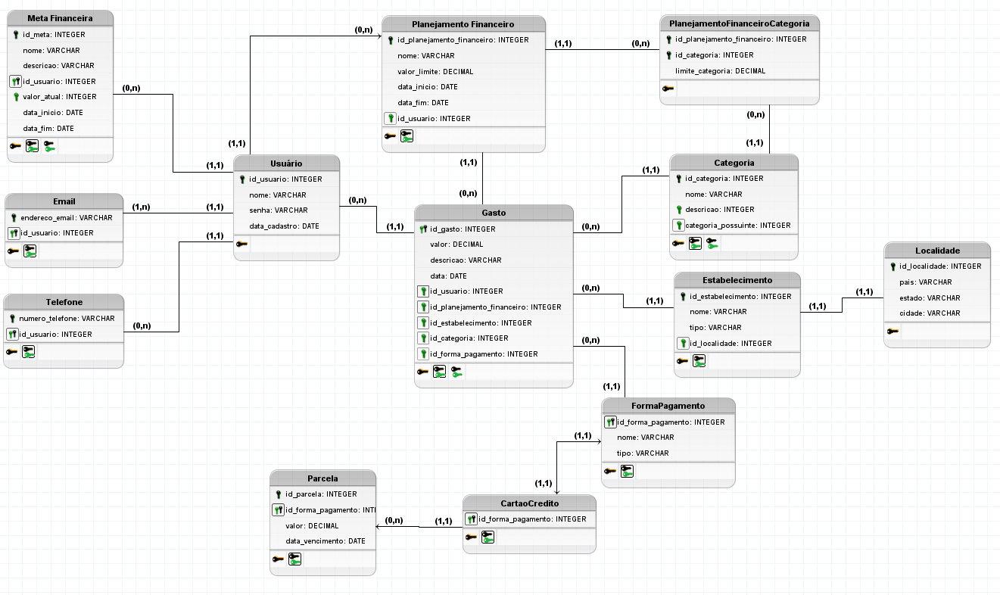

# Finance Tracker

Projeto de Banco de Dados de aplicativo de gestão de finanças que permite ao usuário monitorar seus gastos, definir metas e criar classificações para sua organização pessoal.

Hugo Rocha
Vinícius Spósito

## Sobre o projeto

## Estrutura do Banco de Dados

## Esquema Relacional

## Modelo Conceitual

## Modelo Lógico

## Funcionalidades permitidas pelo Modelo

## Estrutura do Repositório

O repositório contém dentro dele uma pasta de 'projeto' que contém os arquivos Java para a Interface gráfica. Main.java é o arquivo que gera as telas ao se rodar.

Os arquivos 'criacao.sql' e 'insercao.sql' se referem aos arquivos responsáveis por criar o banco de dados e suas tabelas, e inserir as 30 tuplas necessárias em cada tabela, respectivamente.

A pasta 'midia' se refere aos arquivos de imagens para o README.
