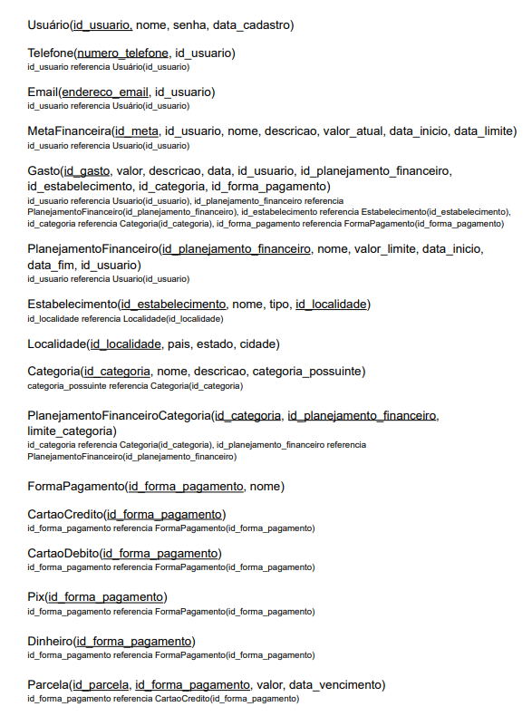
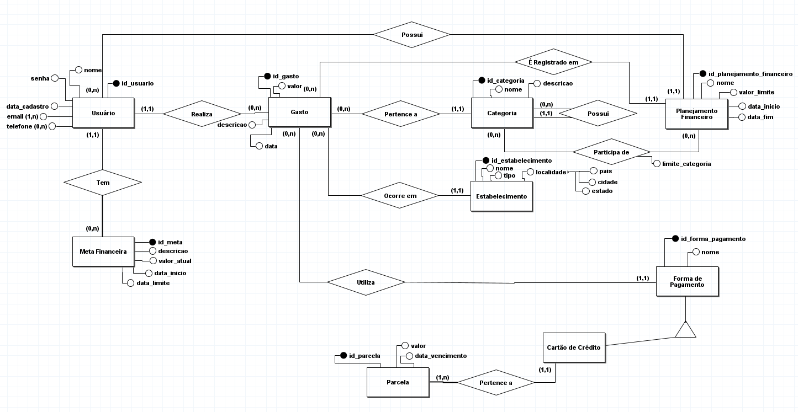
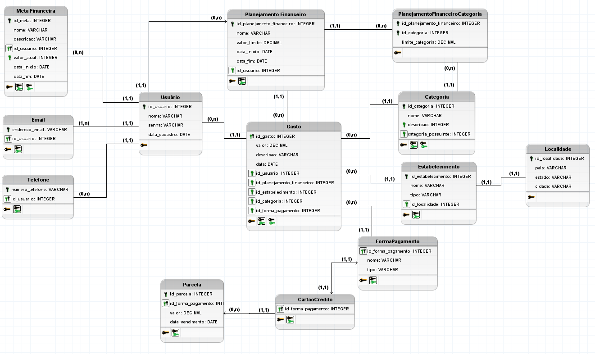

# Finance Tracker

Hugo Rocha;
Vinícius Spósito
## Sobre o projeto
Este projeto é a versão final (Etapa 06) de uma aplicação desktop em Java integrada a um banco de dados MySQL para gerenciamento de finanças pessoais. Ele consolida a modelagem de dados, rotinas SQL e uma interface gráfica (GUI) interativa para manipular e visualizar as informações de forma dinâmica.

## Esquema Relacional



## Modelo Conceitual



## Modelo Lógico



## Requisitos Atendidos (Etapa 06)
- **CRUD Completo (4+ Tabelas):** Implementado para as tabelas `Usuario`, `Categoria`, `Gasto` e `PlanejamentoFinanceiro`.

- **Integração com Rotinas do Banco:**
    - **Função:** Execução da `fn_total_gasto_usuario` através da Tela de Usuários.
    - **Procedimento com Cursor:** Chamada da procedure `EncontrarEstouroPlanejamento` pela Tela de Planejamento.
    - **Trigger:** Visualização dos efeitos do gatilho `trg_log_delete_gasto` (tabela de auditoria `LogGasto`) na Tela de Gastos.

- **Consultas e Views na Interface:** Tela dedicada de relatórios (`TelaRelatorios`) contendo JOINs, Subconsultas e Views (`vw_relatorio_gastos_detalhados`, `vw_total_gastos_usuario`) com filtros interativos por ID.

## Tecnologias Utilizadas
- **Linguagem:** Java 8+ (Swing para Interface Gráfica).
- **Banco de Dados:** MySQL Server.
- **Driver JDBC:** MySQL Connector/J.
- **Padrão de Arquitetura:** MVC (Model, View, DAO, Util).

## ⚙️ Como Configurar e Rodar o Projeto
## Pré-requisitos

Para rodar este projeto na sua máquina, você precisará ter:
- **Java Development Kit (JDK 8 ou superior)** instalado.
- **IntelliJ IDEA** (Community ou Ultimate).
- **MySQL Server** rodando localmente (Workbench, DBeaver ou prompt).
- **MySQL Connector/J** (O driver JDBC do MySQL para conectar o Java ao banco).

---

## ️Passo a Passo de Execução

### Passo 1: Preparação do Banco de Dados (MySQL)
Abra o seu gerenciador de banco de dados (ex: MySQL Workbench) e execute os scripts `.sql` localizados na pasta do projeto. **É estritamente necessário seguir esta ordem exata** para evitar erros de dependência e chaves estrangeiras:

1. `criacao.sql`: Cria o banco de dados `app_financeiro` e a estrutura de todas as tabelas.
2. `insercao.sql`: Popula as tabelas com os dados base de teste (30 inserções por tabela principal, com `AUTO_INCREMENT` configurado).
3. `funcoes.sql`: Cria as funções matemáticas, como a `fn_total_gasto_usuario`.
4. `procedures.sql`: Cria os procedimentos armazenados, incluindo os que utilizam Cursor.
5. `triggers.sql`: Cria os gatilhos de auditoria de banco (ex: salvar na tabela de log após deleção).
6. `views.sql` e `consultas.sql`: Compilam as visões e estruturações para a tela de relatórios.
7. `indexes.sql`: Criação dos índices para otimização das consultas.

### Passo 2: Importando o Projeto no IntelliJ IDEA
1. Abra o **IntelliJ IDEA**.
2. Vá em **File > Open** e selecione a pasta raiz do projeto.
3. Aguarde a IDE carregar e indexar a estrutura de pacotes (`dao`, `model`, `util`, `view`).
4. **Instalando o Driver do MySQL:** Para resolver erros de *Driver class not found*, certifique-se de que o conector do MySQL está no projeto.
    - Se for um projeto Maven, verifique se a dependência no `pom.xml` foi baixada.
    - Se for um projeto Java padrão, vá em **File > Project Structure > Modules > Dependencies**, clique no símbolo de **+**, selecione **JARs or directories**, encontre o arquivo `.jar` do MySQL Connector que você baixou na sua máquina e adicione.

### Passo 3: Configuração da Conexão
No painel do projeto do IntelliJ, navegue até a pasta `src > util` e abra a classe **`Conexao.java`**. Verifique se a URL, o usuário e a senha coincidem com o servidor do seu MySQL local:
```java
Connection con = DriverManager.getConnection("jdbc:mysql://localhost:3306/app_financeiro", "root", "12345");
```
(Altere "root" ou "12345" se as credenciais da sua máquina forem diferentes).

### Passo 4: Rodando a Aplicação
No IntelliJ, navegue até a pasta src > view.
Encontre a classe TelaPrincipal.java (ou a classe Main.java configurada na raiz).
Clique com o botão direito em cima do arquivo e selecione "Run 'TelaPrincipal.main()'" (ou clique no ícone de play verde na lateral do código).
O Menu Principal do App Financeiro abrirá em uma nova janela na sua tela